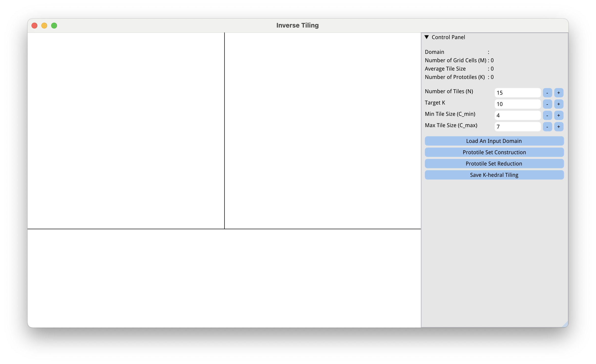
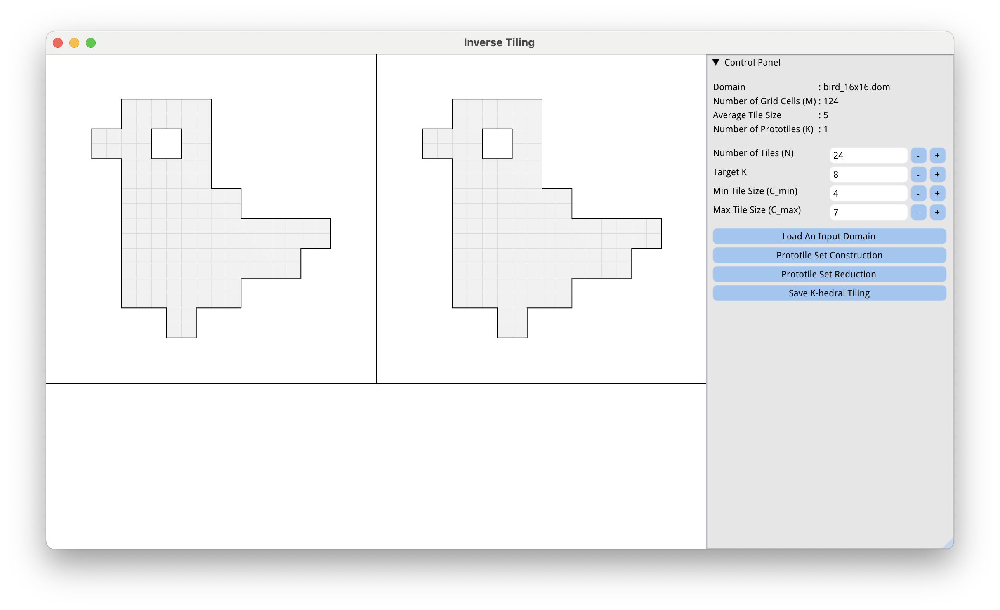
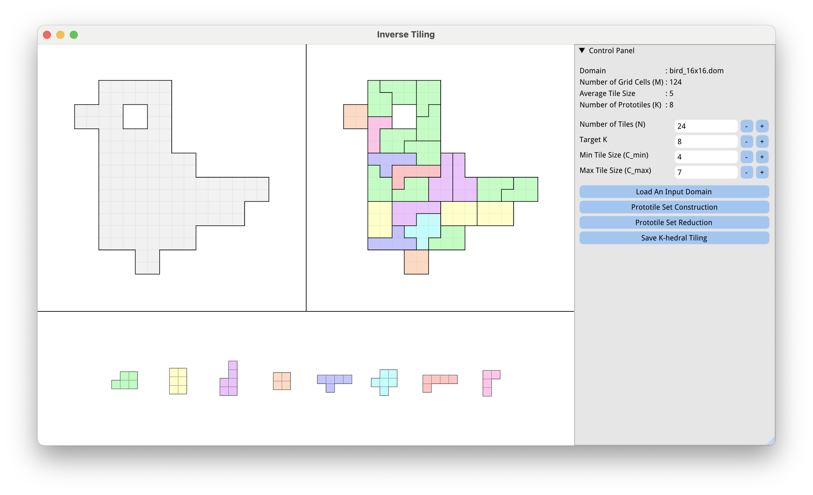
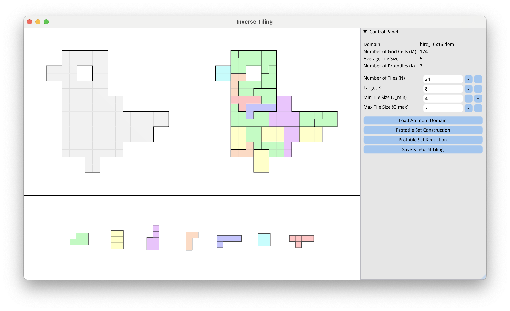
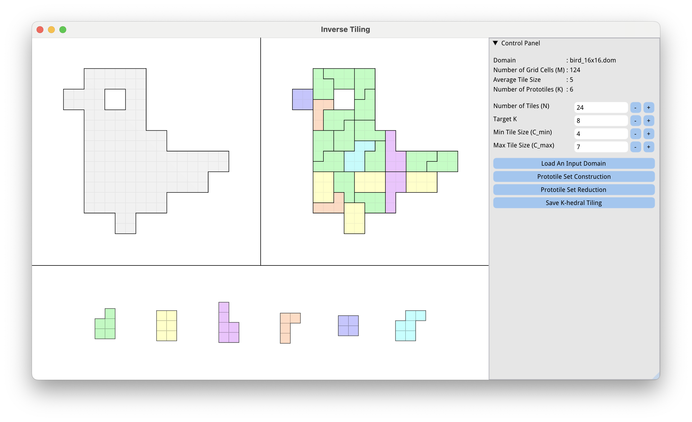
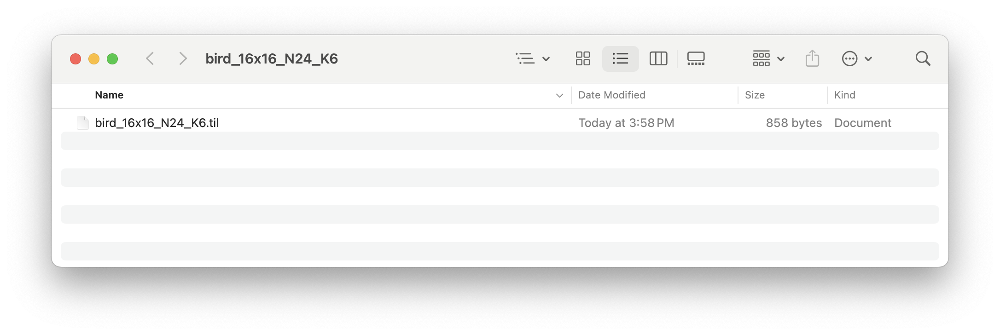

<h3 align="center">Implementation of "Inverse Tiling of 2D Finite Domains"</h3>

## Table of Contents
- [About](#about)
- [Code Installation](#getting_started)
- [Introduction to the GUI Interface](#usage)
- [Step-by-step Instructions for Creating a K-hedral Tiling](#create_puzzle)

## About <a name = "about"></a>
This code repo implements a computational approach called *inverse tiling* to produce K-hedral tilings. 
We implemented our computational approach in C++ and `libigl` [Jacobson et al. 2018] on a desktop computer with 3.6 GHz 8-Core Intel processor and 16 GB RAM. 

## Code Installation <a name = "getting_started"></a>
First, clone the repository, run CMake to generate Makefiles or CMake/Visual Studio project files, and the rest should work automatically.

### **MacOS and Ubuntu**:

```
$ cd [current folder path]
$ mkdir build
$ cd build
$ cmake ..
$ make -j 16
```
The integer following make -j is the number of threads supported by your CPU architecture. Replace it with your optimal value.
Please note that the code has been **tested** on MacOS and Ubuntu environment. 
Specifically, to compile the code in the Ubuntu environment, the following packages are required:

- `libboost-filesystem-dev`
- `libboost-thread-dev`
- `libgmp-dev`
- `libmpfr-dev`
- `libglfw3-dev`
- `libxinerama-dev`
- `libxi-dev`

 ### **Windows**: 
 Our code can be run on VM16 + Ubuntu 20.04 environment.

## Introduction to the GUI Interface <a name = "usage"></a>

<p align="center">
 
</p>


The GUI interface consists of two parts: the visualization panel (the left side) and the control panel (the right side).
The visualization panel is divided into three sub-windows:
(1) the top left window displays the input domain;
(2) the top right window shows the computed K-hedral tiling;
(3) the bottom window visualizes prototiles of the K-hedral tiling.
The control panel has three sub-components: **Status Bar**, **Parameters** and **Control Buttons**.

- ### Status Bar

  `Domain` Display the name of the input domain.

  `Number of Grid Cells (M)` Display the number of grid cells of the input domain.

  `Average Tile Size` Display the average size of tiles, i.e., M / N.

  `Number of Prototiles (K)` Display the number of prototiles in the computed K-hedral tiling.
  
- ### Parameters

  `Number of Tiles (N)` Specify the total number of tiles.

  `Target K` Specify the maximally allowed K of the resulting K-hedral tiling. The program will keep running until constructing a K-hedral tiling whose K is less or equal than the target K.

  `Min Tile Size (C_min)` Specify the minimally allowed size of tiles.

  `Max Tile Size (C_max)` Specify the maximally allowed size of tiles.

- ### Control Buttons

  `Load An Input Domain` Import an input domain in the format of .dom file.

  `Prototile Set Construction` Find a K-hedral tiling whose K is less or equal than the target K, corresponding to Sections 5.1 and 5.2 in the paper. 

  `Prototile Set Reduction` Eliminate few-instances prototiles to reduce the number of prototiles, corresponding to Section 5.3 in the paper.

  `Save K-hedral Tiling` Save the computed K-hedral tiling.

## Step-by-step Instructions for Creating a K-hedral Tiling <a name = "create_puzzle"></a>
These instructions give an example of how to use our program to generate a K-hedral tiling with a given input domain.
Specifically, we use .dom files to store the input domains, and .til files to store the computed K-hedral tilings.

### Step 1: import an input domain
Import a bird_16x16.dom file by clicking `Load An Input Domain` button.

<p align="center">
 
</p>


### Step 2: prototile set construction
Specify the `Number of Tiles (N)` as 24, `Target K` as 8, `Min Tile Size (C_min)` as 4 and `Max Tile Size (C_max)` as 7.
Click the `Prototile Set Construction` button to compute a K-hedral tiling whose K is less or equal than the target K.

<p align="center">
 
</p>


### Step 3: prototile set reduction
Click the `Prototile Set Reduction` button to eliminate few-instances prototiles.
Our program will stop once we can reduce K. You can click the button more than once.
Here, we first click the button and reduce K from 8 to 7.
Then, we click the button again and reduce K from 7 to 6.

<p align="center">
 
</p>

<p align="center">
 
</p>


### Step 4: save K-hedral tiling
Lastly, you can click `Save K-hedral Tiling` to save the computed K-hedral tiling as a .til file with a default file name in the format of "[name of the input domain]_[bounding box of the input domain]_K[the number of prototiles K].til", which can also be loaded by our program.

<p align="center">
 
</p>


